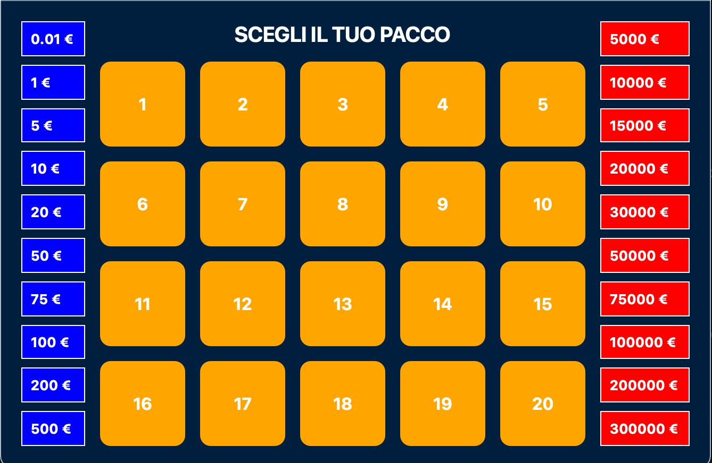

# 📦 Affari Tuoi - Edizione Kids

## 📸 Screenshots
<p align="center">
  
  
</p>

Un'entusiasmante versione digitale del famoso gioco televisivo "Affari Tuoi", sviluppata in Python con la libreria **PyQt5**. Pensata per i bambini, questa versione include la logica del "Dottore", premi personalizzati e una grafica colorata.

## 🚀 Funzionalità
- **20 Pacchi**: Ogni partita i premi vengono mescolati casualmente.
- **Logica del Dottore**: Ogni 3 pacchi aperti, riceverai una telefonata con un'offerta basata sulla media dei premi rimasti.
- **Scambio del Pacco**: Possibilità di scambiare il proprio pacco con uno di quelli rimasti in gioco.
- **Interfaccia Intuitiva**: Colonne laterali (Blu e Rossi) che si aggiornano in tempo reale.
- **Cross-Platform**: Funziona su macOS (tramite script) e Windows (tramite file .exe).

## 🛠️ Requisiti (per sviluppatori)
Se vuoi avviare il gioco direttamente dal codice sorgente, avrai bisogno di:
- Python 3.10+
- PyQt5

Installa le dipendenze con:
```bash
pip install PyQt5
